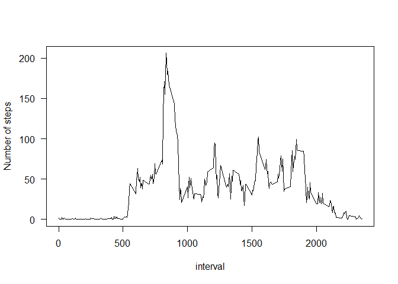
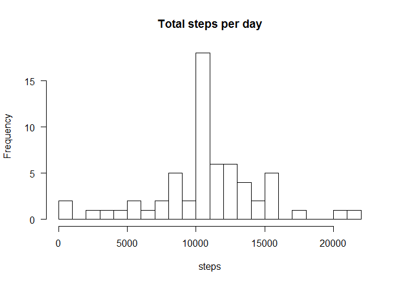
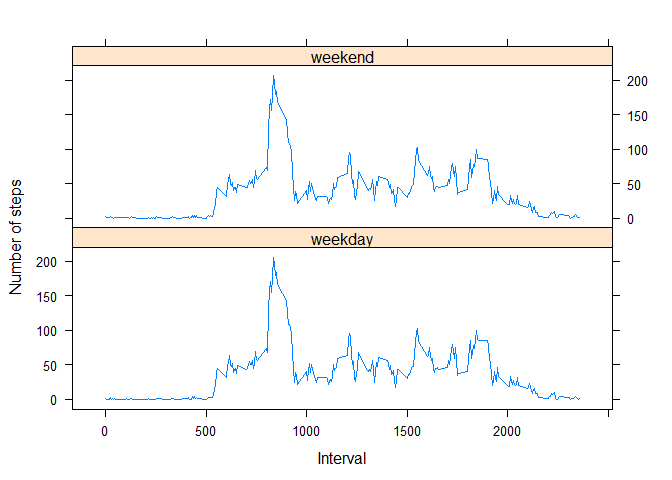

# Reproducible Research: Peer Assessment 1


## Loading and preprocessing the data

```r
require(data.table)
```

```
## Loading required package: data.table
```

```r
require(lubridate)
```

```
## Loading required package: lubridate
## 
## Attaching package: 'lubridate'
## 
## The following objects are masked from 'package:data.table':
## 
##     hour, mday, month, quarter, wday, week, yday, year
```

```r
require(lattice)
```

```
## Loading required package: lattice
```

```r
activity <- data.table(read.table(unz('~/Github/RepData_PeerAssessment1/activity.zip', 'activity.csv'),
                                  header = TRUE, sep = ','))

activity[, steps := as.numeric(steps)]
```

## What is mean total number of steps taken per day?

```r
day_steps <- activity[, .(aver_steps = sum(steps, na.rm = TRUE)), by = ymd(date)]
hist(day_steps$aver_steps, 20, main = 'Total steps per day', xlab = 'steps', las = 1)
```

 

```r
unlist(lapply(list(mean = mean, median = median), function(f) f(day_steps$aver_steps, na.rm = TRUE)))
```

```
##     mean   median 
##  9354.23 10395.00
```

## What is the average daily activity pattern?

```r
interval_steps <- activity[, .(aver_steps = mean(steps, na.rm = TRUE)), by = interval]
plot(interval_steps, type ='l', las = 1)
```

 

```r
interval_steps[which.max(aver_steps)]
```

```
##    interval aver_steps
## 1:      835   206.1698
```

## Imputing missing values
For each NA we impute the mean number of steps of their correspoding time interval.

```r
sum(is.na(activity))
```

```
## [1] 2304
```

```r
invisible(lapply(interval_steps[, interval], function(x){
        value <- interval_steps[interval == x, aver_steps]
        activity[is.na(steps) & interval == x, steps := value]
}))
day_steps <- activity[, .(aver_steps = sum(steps)), by = ymd(date)]
hist(day_steps$aver_steps, 20, main = 'Total steps per day', xlab = 'steps', las = 1)
```

 

```r
unlist(lapply(list(mean = mean, median = median), function(f) f(day_steps$aver_steps)))
```

```
##     mean   median 
## 10766.19 10766.19
```
In fact, the mean and the median are differents from the above result.

## Are there differences in activity patterns between weekdays and weekends?

```r
Sys.setlocale("LC_TIME","English")
```

```
## [1] "English_United States.1252"
```

```r
activity[, weekdays := factor(ifelse(weekdays(ymd(date)) %in% c('Saturday', 'Sunday'),'weekend', 'weekday'))]
week_steps <- activity[, .(aver_steps = mean(steps, na.rm = TRUE), weekdays), by = interval]
xyplot(aver_steps ~ interval | weekdays, data = week_steps, layout = c(1, 2), type="l", xlab = "Interval", ylab = "Number of steps")
```

 
